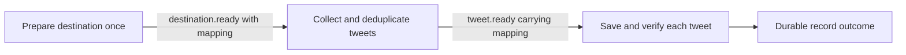

# Browser harness audit: Notion session

Technical proposal: [From user intent to reliable browser execution](browser-harness-intent-and-execution-design.md).

Session: `session_2fa5d83d-72b3-4e97-a7bf-fb84b8c66bf7`

Execution: `exec_7cfa29a1-6867-4943-a308-3cf5fd4f0161`

The main problem is repeated decisions without task progress. The active Notion writer repeatedly opens the same cell, observes it, presses Escape, observes the table, and opens the same cell again. This is visible in the action trace; the model's internal reasoning was not recorded.

This review used the local PostgreSQL execution, model-operation and browser-command records, the recorded screenshot, and the running implementation. The running engine's `tools.ts` and `loop.ts` hashes matched the workspace. No application code, browser control, or Notion content was changed for this audit.

## Measured evidence

For writer `run_5a03bf22-f198-45f4-bad7-bfdacc0b7dd4`, the captured trace covers **12:00:09–12:10:26 UTC on September 20, 2026** (17:30:09–17:40:26 IST), approximately 617 seconds:

| Measurement | Result |
| --- | ---: |
| Model completions | 153 |
| Time in completed model operations | 412.74 s |
| Mean model-operation duration | 2.70 s |
| Model input tokens, summed across requests | 3,067,807 |
| Cached input tokens, included in the above | 1,739,321 |
| Output tokens / reasoning tokens | 13,699 / 6,798 |
| Model-facing tool calls | 156 |
| Total measured tool time | 187.0 s |
| Median model-facing tool duration | 313.5 ms |
| Explicit `page.perceive` calls | 67 |
| `page.find` / `page.inspect` calls | 11 / 12 |
| Clicks targeting the same fourth property-value element | 29 |
| Escape presses | 26 |
| Obstructed clicks | 4, totaling about 122.5 s |
| Context compactions | 17 |
| Verification, outcome or event-emission tool calls | 0 |

At inspection, execution record tracking showed one failed record and four prepared records, with zero verified saves. This does not mean no browser write occurred: the trace contains a new-row interaction and typing, and the recorded screenshot shows an identity in a Name editor. Those partial effects require reconciliation before any replay.

The other three pending Notion writers had no trace entries and were waiting on the same tab lease. One unproductive writer therefore holds up the remaining destination work.

## Prioritized changes

### 1. Detect short cycles and lack of task progress

`packages/agent/src/tools.ts:527` checks repeated identical operations; `:550` resets the count when the operation changes. Opening and closing an editor changes both the operation and observation, so it never triggers the guard. Changing observation scope also changes the fingerprint, and `:553` clears failed-target history on any changed observation.

A local probe using the real tool registry and a synthetic cell/editor accepted all **40 actions in ten open → perceive → Escape → perceive cycles**, ending in the original closed state. It issued no model or external browser calls.

Track a bounded history of stable target identities, actions and comparable page states, including cycles of multiple actions. Separate UI state changes from durable task progress. Paging an observation or opening a menu must not count as progress. On a repeated cycle, provide a concise diagnosis and a scoped observation or screenshot; escalate or terminate the affected operation after bounded unsuccessful recovery. Preserve partial-write evidence and do not automatically replay a create.

Regression coverage should include alternating actions, different observation offsets, changing snapshot IDs and legitimate repeated edits to distinct records. Existing tests cover consecutive repeated clicks, not this cycle.

### 2. Put the active editor and task region first in observations

`packages/browser/src/perception-script.js:61` gathers elements in DOM order, including offscreen elements. `packages/agent/src/tools.ts:175` stops when the serialized observation reaches its budget. Sidebar navigation can therefore consume the budget before the main table and a newly opened editor. The trace contains **49 observations starting at element offset 57**, repeatedly reacquiring the later controls after actions return a default whole-page observation.

Prioritize focused editable controls, open dialogs/popovers, the interacted element's region, and visible main content. Keep navigation available through explicit discovery and pagination. Return the editor's associated field/column and current value together. A compact representation should omit empty state fields and repeated metadata while retaining actionable anchors and coverage information.

After clicking a cell, the immediate result should contain the active editor and enough context to fill or commit it. It should not require a separate model turn merely to page past the sidebar. Keep snapshot fencing; solve the discovery problem rather than accepting stale anchors.

Test a dense sidebar plus a portaled editor with a blank placeholder, and require the editor to appear in the first action result. The recorded screenshot shows just such a title-editing interaction.

### 3. Resolve destination requirements before writing records

The recorded 12:04:30 screenshot shows a database with a **Name** column and **Add property**. The compiled task says both **“Do not create properties”** and that verification must show stable identity and principal tweet content. There is no specified fallback for storing that content when suitable properties are absent.

This establishes an unresolved destination-mapping problem; the screenshot alone does not establish whether all properties are hidden elsewhere or whether page-body storage is usable. Discover the actual schema once, decide where identity and tweet content belong, and persist that mapping for subsequent records. If the available destination cannot satisfy the task, report the concrete missing capability instead of searching indefinitely. Do not assume that entering an ID in Name satisfies saving the tweet.

### 4. Reduce duplicated instructions and preserve useful recovery memory

The stored Notion compiled prompt is 15,765 characters. It includes operating instructions, the author's instructions, schemas, neighboring tasks and a tool list. `packages/agent/src/loop.ts:130` adds another tool description list; native tool schemas are also supplied. The first blank-page Notion model request already used 10,918 input tokens. The measured active writer averaged about 20,051 input tokens per completion.

Use a compact node-specific contract and one authoritative tool/schema definition. Preserve the latest actionable observation, confirmed effects and a short attempt history; summarize superseded observations across turns, not just within one response's tool list (`loop.ts:275`). Automatic memory currently retains tool names and success flags, but the inspected run's `facts` and `pending` arrays were empty. Across 17 compactions it was not retaining a useful explanation of the repeated cell-editing failure.

Measure tokens and time per verified saved record. A smaller request alone will not fix the navigation cycle, but it reduces the cost of every remaining decision. Test observation and recovery changes with the existing selected model before attributing the problem to model capability.

### 5. Align wait deadlines and shorten obstruction recovery

The earlier writer `run_03eb42bb-58be-46f1-88dc-bf1939be183f` requested a 120-second wait for `main` to become hidden. It instead received a transport failure after about 60 seconds and eventually failed with `browser.disconnected`.

`packages/engine/src/browser-hosted.ts:126` applies a fixed 60-second HTTP timeout even though browser tools permit waits up to 120 seconds. Derive the transport deadline from the permitted command timeout plus response overhead, bounded by cancellation and the run budget. A timed-out read/wait must not be mistaken for proof that the whole browser disconnected. Retain uncertainty handling for commands that can write.

Separately, four obstructed clicks each consumed approximately 30 seconds before recovery. Use a short actionability probe and report the obstructing region/editor promptly, with a bounded retry for transient overlays. Long application-loading waits and clicking a visibly obstructed target need different policies.

## Validation target

Build a browser fixture that reproduces the recorded table, dense sidebar, blank-placeholder editor and overlay. Verify that a writer discovers the schema, edits one row, observes the committed identity and content, and records an outcome. Assert that active-editor discovery needs no pagination turn, short action cycles trigger recovery, and waits retain their intended timeout classification. Benchmark completion rate, model calls, input tokens and elapsed time per verified record before and after changes. An end-to-end speedup has not yet been measured.

## Original intent, graph generation and prompt compilation

The user's original request was to fetch 100 distinct tweets from the X For You timeline, deduplicate them and save them in the supplied Notion database, with Google login if needed. It did not forbid creating destination properties or require each tweet to pass through multiple AI bookkeeping steps.

The stored graph is `Collect tweets → Prepare tweet → Save in Notion → Record save outcome`, plus the engine-managed result node. There is no destination setup/readiness task. Every writer must independently discover the destination fields. The five observed Prepare runs each required five model completions and took approximately 12–15 seconds despite primarily normalizing, querying and persisting a single record.

### Confirmed instruction drift

The graph's Notion task says **“Do not invent values or create duplicate properties.”** The compiled operating instructions say **“Do not create properties.”** The compilation pass has strengthened the restriction. Its system prompt also says **“Never invent tools, fields, tables or events that the brief does not list”** (`packages/engine/src/prompt-compiler.ts:290`), without distinguishing internal packet/store schemas from external UI properties discovered at runtime. That wording is a plausible contributor, not a proven account of the model's reasoning.

The prompt compiler's gate (`prompt-compiler.ts:333`) checks only nonempty text, character count and mention of emitted event names. A local probe supplying this strengthened restriction to the actual compiler was accepted. It does not test preservation of intent or whether completion remains possible.

### Changes to the generation contract

1. Extract a small structured contract from the original request: goal, required output, source/destination, explicit constraints and unknowns to discover. Pass the original request and this contract through graph and node compilation. Generated navigation advice must not gain authority to add prohibitions or drop required output.
2. Restrict “do not invent fields” to typed event fields, declared internal store tables and tool names. Treat external website schema as unknown until observed. Permit necessary additive destination setup within the user's task, or a compatible content-storage fallback, while preserving existing data and deduplication.
3. Generate a destination-discovery phase when compatibility is unknown. Produce a durable contract describing destination identity, dedupe strategy, field/content mapping and evidence required for success. Pass it to writers; do not store snapshot anchors as reusable facts.
4. Relax “decision tasks for every semantic or workflow-store phase” (`graph-authoring-prompts.ts:25`). Deterministic normalization, dedupe and bookkeeping should use bounded code or explicit engine operations. Removing AI store nodes requires implementing equivalent persistence behavior; it is not achieved by deleting nodes from the existing graph.
5. Resolve conflicting tab guidance: the shared async contract warns against shared-tab assumptions, while the graph prompt explicitly promises retained task tabs. The node compiler again forbids assuming shared tabs. State the actual guarantee: declared tab keys retain browser state, exclusive leases serialize use, and fresh observations are required before acting. This does not create shared task memory.
6. Give authentication handling an executable capability. Generated prompts tell agents to pause for human takeover, but the browser registry has no tool to request that pause. Existing control waits respond to an externally initiated takeover. A blocked-authentication outcome should notify the UI and suspend work; it should not become repeated LLM waits. Use an existing signed-in flow where sufficient; request human action when necessary.

An initial design that avoids unsupported joins is:

The final result remains engine-managed after all runs settle. The destination contract travels through the source event to each writer, so a writer does not consume two events and incorrectly assume that they form a join. Later, a native readiness barrier and engine-accessible execution state could allow source collection and destination preparation to overlap.

Prefer outcome-oriented task instructions: what must be true, what the current evidence establishes, and which operations are available. Leave page-specific navigation to runtime observations. Evaluate preservation of user intent, discovery of a Name-only database, existing compatible schemas, authentication, partial saves and duplicate records. Keep browser observation and cycle-detection fixes in the same evaluation: a better graph still needs usable action results.
