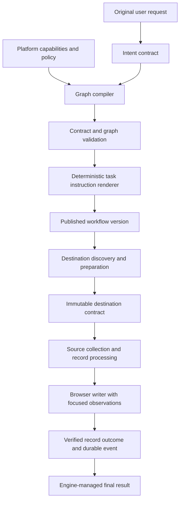
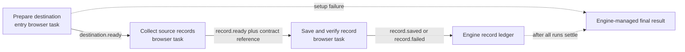
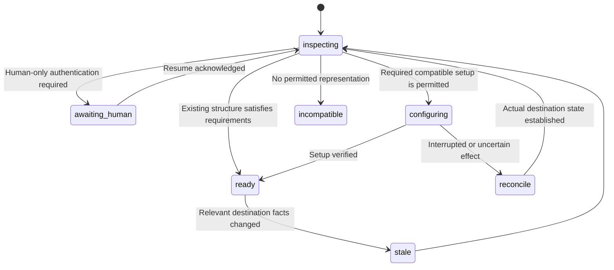
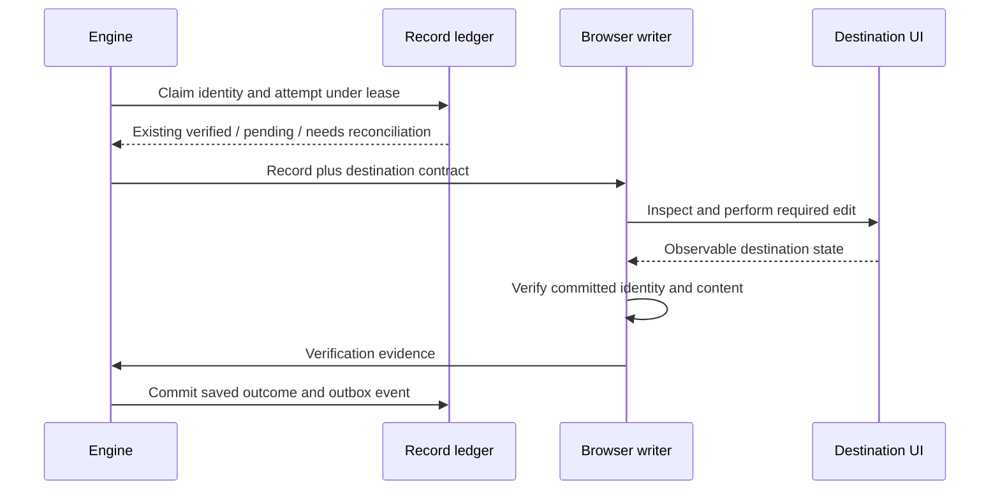

# From user intent to reliable browser execution

**Status:** Version 1 implemented; see [implementation, validation and rollout notes](browser-harness-implementation.md). This document retains the full design, including future in-execution contract revisions and live evaluation targets.  
**Date:** September 20, 2026.  
**Scope:** Graph generation, task compilation, destination discovery, deterministic record processing, and browser execution.  
**Evidence:** [Notion session audit](browser-harness-audit-2026-09-20.md).

## Purpose

Tabductor should turn a request such as “fetch 100 tweets from my For You timeline, deduplicate them, and save them in this Notion database” into an executable workflow that preserves that outcome. The user should not need to specify a graph, destination property names, browser selectors, retry protocols, or bookkeeping tasks.

The audited execution demonstrates a failure across several layers. Graph generation omitted destination preparation. Task compilation strengthened an instruction against duplicate properties into a prohibition on creating any properties. Runtime observations repeatedly made the agent page through the UI. The recovery guard accepted a cycle of opening an editor and closing it without saving the record.

This proposal develops five changes:

1. Preserve the original intent through every compilation stage.
2. Separate internal schemas from external website structure.
3. Discover the destination once and reuse a validated mapping.
4. Execute routine bookkeeping without repeated model decisions.
5. Give browser tasks outcome-oriented instructions and executable recovery capabilities.

The design retains event-driven execution, execution-pinned workflow versions, browser ownership fencing, record deduplication, and evidence-based completion. It changes how requirements are represented and how the engine helps an agent satisfy them.

## Contents

- [1. Evidence and design boundaries](#1-evidence-and-design-boundaries)
- [2. Proposed architecture](#2-proposed-architecture)
- [3. Suggestion 1: Preserve intent through compilation](#3-suggestion-1-preserve-intent-through-compilation)
- [4. Suggestion 2: Separate schemas from website structure](#4-suggestion-2-separate-schemas-from-website-structure)
- [5. Suggestion 3: Discover and prepare the destination once](#5-suggestion-3-discover-and-prepare-the-destination-once)
- [6. Suggestion 4: Make bookkeeping deterministic](#6-suggestion-4-make-bookkeeping-deterministic)
- [7. Suggestion 5: Use outcome-oriented tasks and executable recovery](#7-suggestion-5-use-outcome-oriented-tasks-and-executable-recovery)
- [8. Implementation map](#8-implementation-map)
- [9. Migration and rollout](#9-migration-and-rollout)
- [10. Evaluation and acceptance criteria](#10-evaluation-and-acceptance-criteria)
- [11. Decisions and remaining questions](#11-decisions-and-remaining-questions)

## 1. Evidence and design boundaries

### 1.1 What the audited execution established

The audit covers session `session_2fa5d83d-72b3-4e97-a7bf-fb84b8c66bf7`. Its active Notion writer made 153 model completions in a captured interval of approximately 617 seconds. Those completed model operations consumed 412.74 seconds, averaging 2.70 seconds each. Four obstructed clicks consumed another approximately 122.5 seconds. The median model-facing tool duration was 313.5 milliseconds.

The writer clicked the same property-value target 29 times and pressed Escape 26 times. It made no verification, record-outcome, or event-emission calls during that interval. The execution had zero verified saves at inspection. Browser-side partial writes may still have occurred and must be reconciled before retrying.

Two local probes reproduced implementation gaps without calling a model or interacting with an external website:

- The real tool registry accepted all 40 actions in ten open-cell → perceive → Escape → perceive cycles.
- The real prompt compiler accepted instructions that changed “do not create duplicate properties” into “do not create properties.”

The recorded screenshot showed a Name column and an Add property control. It did not establish whether other properties were hidden or whether page-body storage was suitable. The confirmed problem is the absence of a completed destination-mapping decision, rather than proof that Notion could not store the data.

### 1.2 What the current implementation already provides

| Existing component | Relevant behavior |
| --- | --- |
| `graph.automationPrompt` | Can retain the workflow request in the published graph. |
| Graph and record-contract gates | Check structure, wiring, required record identities, and some cross-event type/nullability compatibility. |
| Execution version pinning | Downstream events route through the version selected for that execution. |
| Browser tab leases | Serialize runs using the same declared tab key and retain that tab's page state. |
| Snapshot anchors | Prevent a stale observation from silently targeting a different DOM node. |
| Checkpoints and exploration memory | Preserve bounded progress and some observations, with limited scope. |
| `record.outcome` and `workflow_records` | Track record disposition and require browser verification for a saved outcome. |
| `RunHandle.emit(..., { withTx })` | Supports atomic internal store changes with event publication. |
| `browser.code` | Supports bounded deterministic computation and calls to existing browser tools. |

These are useful foundations. They should be extended rather than replaced with an unrelated orchestration framework.

### 1.3 Boundaries

This document proposes new contracts, tables, tools, and behavior explicitly. TypeScript examples are interface sketches, not declarations of existing APIs. Proposed thresholds and performance targets are starting values for evaluation, not measured improvements.

Website navigation remains browser-based. The proposal does not depend on a Notion API connector, arbitrary HTTP access, a general-purpose server scripting runtime, or direct browser access to arbitrary workflow-store tables. Existing user constraints and platform policy remain authoritative.

## 2. Proposed architecture

Compilation should determine the required outcome and the permitted capabilities. Runtime discovery should determine how the current website can deliver that outcome.



Four artifacts have distinct responsibilities:

| Artifact | Answers | Lifetime |
| --- | --- | --- |
| Intent contract | What did the user ask to accomplish, and what restrictions apply? | Immutable within a published workflow version. |
| Task contract | What part of the outcome does this task own, with which inputs and capabilities? | Immutable within that version. |
| Destination contract | What destination was observed, and how can required data be stored and verified there? | Immutable revision, scoped to an execution and destination. |
| Runtime progress | What has been attempted, acknowledged, verified, or left uncertain? | Mutable, durable, and fenced by execution/run ownership. |

The core invariants are:

- A generated suggestion cannot become a new user restriction.
- Every required outcome has a producer, a transport path, and observable completion evidence.
- Discovery is allowed to resolve unknown UI structure; it cannot redefine the task's required output.
- A model cannot grant itself capabilities by returning policy-shaped JSON.
- A successful click, accepted event, or prepared record is not a verified destination save.
- Internal transactions cannot make an external browser write atomic. Retries must reconcile uncertain effects.
- Reusing a tab preserves browser state, not shared agent memory or valid anchors.

## 3. Suggestion 1: Preserve intent through compilation

### 3.1 Current failure

The current pipeline performs several transformations: workflow intent becomes graph tasks, event descriptions become schemas, and task prompts become expanded operating instructions. The node compiler prepends generated prose to a deterministic brief. The runtime then adds instructions and another description of the tool surface.

The node compiler's current gate checks whether the generated text is nonempty, bounded, and names the emitted events. It does not check whether the output adds constraints, omits required content, or makes the task impossible. Including the original task farther down the prompt does not resolve a contradiction near the beginning.

Relevant implementation: [prompt compiler](../packages/engine/src/prompt-compiler.ts), [graph authoring prompt](../packages/engine/src/graph-authoring-prompts.ts), [graph publication](../packages/engine/src/graph.ts), and [agent loop](../packages/agent/src/loop.ts).

### 3.2 Introduce a versioned intent contract

Capture the original request separately from the graph generator's interpretation. Retain the original text, its digest, the interpreted requirements, and the origin of restrictions.

```ts
// Proposed interfaces; identifiers are illustrative.
type RuleOrigin =
  | { kind: "user"; requestDigest: string; quote: string }
  | { kind: "platform"; ruleId: string; version: number };

type IntentContract = {
  version: 1;
  originalRequest: string;
  requestDigest: string;
  objective: string;
  requirements: Array<{
    id: string;
    description: string;
    category: "source" | "destination" | "content" | "count" | "dedupe";
    origin: RuleOrigin;
  }>;
  constraints: Array<{
    id: string;
    predicate: string; // Validated, versioned rule identifier.
    parameters: Record<string, unknown>;
    origin: RuleOrigin;
  }>;
  quantity?: {
    target: number;
    measure: "source-records" | "unique-records" | "verified-saves";
    interpretation: "explicit-user-requirement" | "planning-default";
  };
  discoveries: Array<{
    id: string;
    question: string;
    requiredBefore: "collect" | "write" | "complete";
  }>;
};
```

For the audited request, the requirements include the For You feed, a target of 100 tweets, deduplication, and storage in the supplied database. Destination field names, supported content locations, authentication state, and edit permissions are discoveries. “Never create a property” is not an extracted requirement.

Record where the quantity applies. “Fetch 100 and deduplicate” and “save 100 new unique records” are different contracts. If the request leaves this implicit, record the chosen interpretation as a revisable planning default rather than claiming the user explicitly required it. Report fetched, unique, existing/skipped and newly saved counts separately. An ordinary reasonable interpretation need not trigger a clarification, but it must not silently expand the required work or hide a shortfall.

The host validates user quotes against the original request and resolves platform rules from a trusted registry. A matching quote establishes provenance, not proof that an arbitrary interpretation is correct. Structured interpretation still needs consistency checks and behavioral evaluation.

Defaults such as a conventional record title are planning decisions. Store them separately from user constraints and make them revisable when observations contradict them. Do not require a clarification for every ordinary implementation choice.

### 3.3 Compile task contracts before prose

```ts
type TaskContract = {
  version: 1;
  logicalId: string;
  objective: string;
  requirementIds: string[];
  constraintIds: string[];
  inputEventTypes: string[];
  outputEventTypes: string[];
  capabilityIds: string[];
  preconditions: Array<{
    fact: string;
    establishedBy: { taskLogicalId: string; eventType: string };
  }>;
  postconditions: Array<{
    requirementId: string;
    evidenceKind: "source-observation" | "destination-record" | "record-ledger";
  }>;
  recoveryPolicyId: string;
};
```

The compiler may select existing constraints and capabilities; it cannot create arbitrary new mandatory policy. The host computes the effective capability set from platform support and the authorized task scope. A capability identifier in model output is a request for validation, not authority.

A task's contract should identify its responsibility, not prescribe the exact buttons it will click. The Notion writer's responsibility is to persist and verify one triggering record using the destination mapping. It should not independently redesign the database on every record.

### 3.4 Replace unrestricted instruction expansion

The recommended end state is a deterministic renderer for authoritative instructions. It renders:

1. The task objective and the relevant original requirements.
2. Validated restrictions and capability boundaries.
3. Typed inputs and declared outcomes.
4. Established runtime facts and unresolved discoveries.
5. Completion evidence and recovery behavior.

Native tool definitions remain the authoritative parameter schemas. Remove duplicate full tool lists and unrelated neighboring task prompts from each completion request. Provide concise producer/consumer context only where it changes behavior.

An optional model may suggest a strategy during authoring or runtime, but that strategy must remain revisable advice. Merely labeling free prose as “advice” is insufficient protection against instruction drift; do not append unconstrained generated policy paragraphs to the authoritative prompt. Prefer structured strategy choices with bounded parameters, or omit the extra model pass.

A transitional compiler can keep the existing brief and add explicit intent-preservation rules, while running a semantic contradiction check. This is an interim measure. Keyword matching cannot prove equivalence of arbitrary natural-language instructions.

### 3.5 Validate realizability and requirement coverage

Add diagnostics with stable codes:

| Diagnostic | Example |
| --- | --- |
| `constraint_origin_missing` | Generated prohibition has no user or platform origin. |
| `required_output_unmapped` | Tweet content is required but no destination content location is discovered or scheduled for discovery. |
| `precondition_unproduced` | Writer requires a destination mapping, but no task establishes one. |
| `capability_unavailable` | Task instructs a human pause without an executable pause capability. |
| `record_identity_drift` | A source URL is substituted into a field declared to be a native tweet ID. |
| `completion_evidence_missing` | Saved outcome can be emitted without identity and required-content verification. |
| `unsupported_join` | Two event subscriptions are described as if they produce one combined input. |

At publication, unknown website facts are valid only when the graph assigns their discovery before use. Publication cannot prove a site's current schema without observing it. Runtime destination validation resolves that remaining uncertainty.

Use deterministic checks for typed contracts, known capabilities, event paths, identity preservation, and evidence requirements. Use a bounded semantic review for ambiguities that remain in prose. A model review can flag probable contradictions, but its approval is not a guarantee; evaluate the generated workflow against browser fixtures.

### 3.6 Versioning and fallback behavior

Persist the intent and task contracts with the immutable published version. Extend prompt and content hashes with the relevant contract digest, renderer version, capability version, and verification policy version. Review both `promptInputHash` and task content hashes: the current code intentionally excludes some assembled prompt context from compiled-script reuse, so a changed authority contract must explicitly invalidate incompatible artifacts.

An unrelated label change should not invalidate a working browser script. A changed required field, destination policy, record identity, or verification rule should.

If strategy generation fails, render validated contracts deterministically. If contract validation fails, return a specific authoring diagnostic. Do not silently fall back to prose that has already been found contradictory. Existing executions continue with their pinned version; a new publication does not repair an already-running task in place.

## 4. Suggestion 2: Separate schemas from website structure

### 4.1 Introduce explicit namespaces

The current instruction “Never invent tools, fields, tables or events” conflates several unrelated concepts. Replace that vocabulary with named categories:

| Namespace | Authority | Permitted behavior |
| --- | --- | --- |
| `packet.*` | Published event schema | Read and emit declared fields; preserve type and nullability. |
| `store.*` | Published internal store schema and grants | Use supported operations on declared tables. |
| `tool.*` | Runtime capability registry | Call only available tools with validated arguments. |
| `ui.*` | Current browser observation | Discover controls, columns, editors and pages; acquire fresh anchors. |
| `destination.*` | Validated destination contract | Use observed field/content mappings and permitted setup operations. |
| `outcome.*` | Task contract and verification policy | Record success only when required evidence is established. |

An external Notion property is not an internal event field. Discovering that property does not change the packet schema. Creating a required destination property, when permitted by task scope and platform policy, does not authorize creating an arbitrary internal SQL table.

### 4.2 Separate observation from creation policy

Destination discovery returns facts: observed fields, types, visibility, content locations, and available edit controls. The host separately evaluates what modifications the task may perform.

```ts
type DestinationPolicy = {
  version: 1;
  destinationScope: string;
  recordActions: Array<"create" | "update" | "append-content">;
  schemaActions: Array<"add-required-property">;
  preserveExistingValues: boolean;
  ruleRefs: string[];
};
```

This interface is proposed. Its values must come from validated intent and platform policy, never from a page's text or a model's self-declared permission. An explicitly requested “do not change the database schema” constraint sets `schemaActions` to an empty list. Its absence should not cause a compiler to invent that restriction.

Necessary additive setup within the specified destination can be an ordinary implementation choice for the requested save operation. Keep it bounded to requirements and preserve existing data. The model must inspect for a compatible existing property before proposing a new one. Deleting records, renaming unrelated properties, or changing sharing settings is outside this setup contract.

### 4.3 Mapping rules

Apply these rules in order:

1. Reuse a compatible existing field or content location whose meaning has been established.
2. Prefer a stable identity field for deduplication, and a human-readable title where the UI supports both.
3. If a required value has no suitable location, consider a verified page-body location or permitted additive property setup.
4. If neither route can satisfy the requirement, return a concrete incompatibility outcome identifying the missing capability.
5. Omit unsupported optional metadata only when the task contract marks it optional. Preserve the reason in the destination contract.

For a Name-only database, a candidate mapping might use Name for an identifiable title and the row's page body for tweet text plus source URL. Another candidate might add a Source URL property and use the page body for content. Neither is assumed usable before browser inspection verifies it.

The user requested saving tweets. Persisting only an ID should not satisfy the required-content condition. Conversely, optional engagement counters should not prevent saving the core tweet when the destination can store its identity, content and source.

### 4.4 Value provenance

Distinguish observed values, deterministic transformations, and engine-provided metadata:

- An unavailable source count remains null.
- A canonical source URL can be derived under a named URL normalization rule.
- A current saved timestamp can come from the engine clock; it is not a fabricated source timestamp.
- A derived identity can use `url:<canonical URL>` in `stable_identity` while leaving an absent native `tweet_id` null.
- A renamed or transformed value must not silently replace a source field with different semantics.

Extend existing [record-contract validation](../packages/engine/src/record-contracts.ts) rather than duplicating its type and nullability logic. A later semantic mapping check should additionally verify that every required source value reaches a destination location or an explicit failure outcome.

### 4.5 Prompt rule to adopt

The following is a proposed shared rule for generation and runtime:

> Preserve declared packet schemas, internal store schemas and tool interfaces. Discover external website structure through current observations. Use compatible destination fields or content locations, and perform necessary setup only within the effective destination policy. Do not convert unknown website structure into a prohibition. Preserve required user output and report a specific incompatibility when it cannot be represented.

Keep this rule in one versioned source so the graph compiler, task renderer and agent do not receive contradictory variants.

## 5. Suggestion 3: Discover and prepare the destination once

### 5.1 Put readiness in the graph

The current graph starts collecting records before establishing how the destination will store them. Each downstream Notion writer receives a tweet but no shared field mapping, verified schema, or settled setup decision.

Start with a graph that uses the existing event-routing model without a join:



Use a shared destination tab key for setup and writing, and a distinct source tab key. Source collection starts after destination readiness. Source extraction and writing can then overlap through ordinary per-record events.

`destination.ready` is a control event, so it has no `event.record` metadata. The source forwards the contract reference with each record. The writer consumes one combined record event; subscribing separately to `destination.ready` and `record.ready` would start independent runs and would not create a join.

The final result remains a `kind="result"` node invoked by the engine after work settles. It is not a normal subscriber that runs once per saved record.

### 5.2 Preparation responsibilities

The preparation task should:

1. Reach the specified destination and establish its identity.
2. Use an available authenticated browser flow; request human action only when a human-only step is required.
3. Inspect existing fields, row navigation, editable content locations, and available search/filter behavior.
4. Map required source values and the stable identity to destination locations.
5. Reuse compatible structure or perform permitted additive setup once.
6. Verify the resulting structure and produce a destination contract.
7. Publish readiness only after validation and durable storage succeed.

Do not create a throwaway record merely to test the interface. Preparation should use observable schema/editor capabilities. If a first real record is needed to validate a write path, treat that as the first production record with normal identity, effect tracking, and verification—not an untracked probe.

### 5.3 Destination contract

```ts
type DestinationContract = {
  version: 1;
  id: string;                 // Assigned by the host.
  revision: number;
  executionId: string;
  intentDigest: string;
  policyDigest: string;
  destination: {
    identity: string;         // Observed canonical database identity.
    canonicalUrl: string;
    tabKey: string;
    authenticatedContextId: string;
  };
  fields: Array<{
    sourceField: string;
    required: boolean;
    target: {
      kind: "title" | "property" | "page-body";
      name?: string;
      observedType?: string;
    };
    encoding: "identity" | "plain-text" | "url" | "integer" | "json-text";
  }>;
  dedupe: {
    sourceField: string;
    lookup: "exact-property" | "exact-title" | "record-body";
    location: string;
  };
  verification: {
    requiredSourceFields: string[];
    requireCommittedRecord: true;
    requireIdentityMatch: true;
    requireUnambiguousMatch: true;
  };
  unsupportedOptionalFields: Array<{ field: string; reason: string }>;
  schemaFingerprint: string;
  evidenceRefs: string[];
  observedAt: string;
};
```

`authenticatedContextId` identifies the browser/profile context, not a token or credential. Contract facts must not contain cookies, secret input values, screenshots, arbitrary DOM trees, or snapshot anchors. Selector hints can be separate, revisable navigation advice; they are not a substitute for current observations.

The host assigns identifiers, binds the contract to the active execution and destination scope, checks required field coverage and policy, and computes its digest. Browser evidence supports claims about identity and schema. A model-authored object alone must not establish readiness.

### 5.4 Event representation and schema compatibility

The current schema generator restricts nesting and excludes `$ref`. Do not ask it to invent deeply nested destination contracts in every tweet packet. Use a small event reference:

```json
{
  "destination_contract_id": "dc_example",
  "destination_contract_revision": 1,
  "destination_contract_digest": "sha256:example",
  "destination_key": "notion-tweets"
}
```

These example identifiers are placeholders. The actual event fields use the project's validated scalar types. A new, narrow `destination.contract.read` capability resolves the reference under the run's account, execution, workflow version, and declared destination. It returns the bounded mapping once at task initialization. It does not expose arbitrary workflow-store reads.

The reference's digest detects mismatches; possession of an ID is not authorization. The server checks scope and supplies the authoritative stored object. Refuse cross-account, cross-execution, stale-policy, or incompatible-version references before browser writes.

Platform-owned control-event schemas should be deterministic and versioned. The graph/schema compiler can compose their known scalar fields with application record fields. Do not encode a rich contract as an opaque JSON string merely to bypass schema restrictions.

### 5.5 Persistence and fencing

Introduce two proposed tables:

| Table | Key and purpose |
| --- | --- |
| `destination_preparations` | One mutable preparation state per execution and destination key; owner run ID, lease generation, state, active contract ID, and failure reason. |
| `destination_contracts` | Immutable revisions containing scoped mapping JSON, digest, policy/intent versions, schema fingerprint, and evidence references. |

A unique execution/destination key prevents competing setup runs from independently deciding to create the same property. Claim preparation ownership in a short database transaction and fence updates by run generation. Do not keep a transaction open while the browser operates.

Preparation has these logical states:



These are preparation states, not additions automatically implied for the current run-status enum. Suspension requires the explicit engine work described in section 7.

Persist the validated immutable contract, update the active preparation state, and publish `destination.ready` in one internal transaction under the current lease. Reuse the existing outbox semantics. An interrupted property creation must be inspected before retrying; the database transaction cannot roll it back remotely.

### 5.6 Freshness and reuse

Reuse the mapping across records in the same execution while acquiring fresh page observations. Revalidate relevant facts when:

- The browser arrives at a different database or workspace.
- The required field or content location is missing or has an incompatible type.
- Authentication changes to a different account/context.
- A user changes relevant destination structure during takeover.
- The intent, capability, or destination policy version differs.

An unrelated menu opening or a changed snapshot ID does not invalidate the mapping. A human takeover requires fresh observation and relevant checks, not automatic re-creation of every property.

After schema drift, pause new writes for that destination and designate one preparation owner to reconcile. Waiting writers must not each create their own replacement mapping. An immutable old revision remains available for auditing; new writers use the validated replacement revision.

Mappings reused across separate workflow executions are hints requiring revalidation. Preserve the observed canonical destination identity so alternate view URLs do not create unrelated dedupe namespaces. Do not infer that arbitrary URL query parameters are irrelevant without establishing destination identity.

### 5.7 Success and duplication evidence

The writer should establish that the committed destination record contains both the stable identity and required content. The current `page.verify` can establish identity from an input value, which may still be an uncommitted editor. Extend verification to distinguish an editable draft from a committed record: use observable application confirmation or reopen/read the row after the edit is committed.

Require an unambiguous match under the selected dedupe strategy. An absence claim needs adequate coverage—one visible table viewport does not prove no duplicate exists. Exact application search can be useful evidence when its scope and results are known; otherwise return an explicit uncertainty and avoid another create.

Verification should accept the observed canonical database/row relationship. Requiring a literal full view URL as a substring of every row URL is brittle when the UI changes query parameters or opens a dedicated row page.

## 6. Suggestion 4: Make bookkeeping deterministic

### 6.1 Current cost and architectural constraint

The current graph prompt says to use decision tasks for every semantic or workflow-store phase. In the audited execution, five preparation runs each used five model calls and approximately 12–15 seconds for a record. Much of their work was normalization, lookup, upsert, event construction and outcome recording.

The engine already tracks records in `workflow_records` and `run_record_outcomes`. The graph also introduced application store tables and AI nodes to maintain save state. Some persistence may be useful across executions, but maintaining mechanically derived state should not require a new model decision each time.

Browser tasks currently have no workflow-store access, and graph-authored modes are constrained. Deleting the AI nodes without replacing their persistence behavior would break deduplication and retry semantics.

### 6.2 Recommended implementation: declarative record processing

Add engine-owned processing associated with declared record events and task admission. Start with a small registry of reviewed operations; avoid creating a new arbitrary-code executor or reusing the browser `compiled` mode for unrelated work.

```ts
type RecordProcessingContract = {
  version: 1;
  collection: string;
  identity: {
    preferField: string;
    fallbackField?: string;
    fallbackPrefix?: string;
  };
  normalizers: Array<{
    operation: "trim" | "canonical-url" | "parse-count";
    inputField: string;
    outputField: string;
    ruleVersion: number;
  }>;
  destinationKey: string;
  dedupeScope: "execution" | "workflow-destination";
  persistOutcome: true;
};
```

All fields and operations require validation against the event schemas and the installed operation registry. The model selects supported transformations; it cannot supply JavaScript or SQL through this contract. Rules that cannot be defined deterministically remain decision tasks.

Proposed execution points:

- **Before source-event publication:** validate, normalize declared fields, derive a distinct stable identity, and atomically publish the accepted record.
- **Before writer admission:** check duplicate state and claim the destination record's write attempt, or produce an explicit skipped/reconcile outcome.
- **After browser verification:** persist the verified result and publish the declared outcome in one internal transaction.

Errors become typed record outcomes with stable reasons. Do not silently discard records or merely omit their events.

### 6.3 Preserve source semantics

Operations need narrow, documented behavior. For example, whitespace trimming must not change the meaning of tweet text, and URL canonicalization must use a known rule rather than stripping all query parameters. Locale-dependent abbreviated counts remain null or a separately preserved source string when the parse is ambiguous.

Identity derivation should produce `stable_identity` from a real source ID where present, or from a canonical URL otherwise. It must not fill `tweet_id` with a URL-shaped surrogate. Input and output schemas should express that distinction.

Use existing `browser.code` for bounded extraction and transformations inside a browser task where appropriate. Central record identity, dedupe claims, event validation and durable outcomes belong in the host because they must remain consistent across retries and tasks.

### 6.4 Execution-local and persistent dedupe

The existing `workflow_records` key is execution-scoped. It cannot alone establish that a record was saved by a previous execution. A cross-execution destination ledger is therefore a separate proposed facility, not a capability to assume exists.

Use a uniqueness scope such as:

```text
(account_id, workflow_id, destination_identity, collection, stable_identity)
```

The destination identity refers to the observed database, not the current view URL. The ledger stores the destination row identity/URL, last verified content digest, verification-policy version, outcome, and any uncertain write attempt. Contract revisions are associated evidence, not a way to evade deduplication by changing the key.

Define whether a repeated request should skip an unchanged record or update it when source content changes. The user requested deduplication; that should not accidentally prohibit an explicitly requested update workflow. Select this behavior in the intent/record contract.

### 6.5 External effects and transaction boundaries



Do not hold a database lock across browser interaction. Use durable attempt ownership and short fenced transactions. If the browser may have committed a write before the run loses its lease, leave an uncertain effect that a replacement must reconcile. A stale writer's delayed acknowledgement cannot overwrite a newer owner.

An expired lease alone does not prove that a remote command stopped. Drain or fence admitted commands, then inspect the destination before a replacement creates a record. The system provides deduplication and reconciliation, not a claim of exactly-once external writes.

Build on [record progress](../packages/engine/src/record-progress.ts), [run execution contracts](../packages/engine/src/executor.ts), and the existing outbox path. A new host operation can atomically commit verified record state with its event. It must preserve the current rule that an unverified record cannot acquire a saved status.

### 6.6 When an AI decision task remains appropriate

Keep a decision task when the operation needs judgment: categorizing content, deciding relevance, summarizing, resolving an ambiguous semantic match, or interpreting an unfamiliar destination schema. Avoid using one solely to copy fields, apply a documented normalization, look up a dedupe key, or mark a verified save as saved.

The graph compiler should estimate model work per record and identify deterministic candidates. That estimate is advisory and should be compared with execution telemetry. Optimization must preserve the original success criteria and explicit failure outcomes.

### 6.7 Compatibility

Add record-processing configuration as a versioned graph/schema feature and reject unsupported configurations on older engines. Keep the current AI store nodes for legacy workflows until they are republished under the new contract. An execution already in progress retains its original record protocol.

Reuse engine record outcomes instead of creating a second competing source of truth. The execution ledger supplies per-run reporting; the destination ledger supplies cross-execution idempotency. Define and test their transactional update boundary.

## 7. Suggestion 5: Use outcome-oriented tasks and executable recovery

### 7.1 Define a compact runtime instruction structure

The agent needs a clear objective, current evidence and usable actions. It should not receive several versions of the same procedure with different restrictions.

Render the runtime request in this order:

| Section | Content |
| --- | --- |
| Objective | The task's required outcome and relevant original requirements. |
| Input | One typed triggering record or a setup trigger; untrusted values clearly delimited. |
| Destination facts | Validated mapping, identity, required fields and verification conditions. |
| Constraints | Only applicable user and platform rules, with stable references. |
| Current state | Latest actionable observation, pending effects and concise recovery memory. |
| Outcome protocol | When to verify, record saved/skipped/failed, emit and finish. |
| Capabilities | Native tool definitions, plus brief explanations of behavior not evident from their schemas. |

The task objective stays stable; navigation strategy changes with observations. Avoid embedding a precomputed click sequence for an unobserved website. Include the original user request during compilation and retain a bounded relevant excerpt at runtime when it clarifies scope. Do not repeat the entire graph and every neighboring prompt on every turn.

A proposed writer instruction template is:

> Save this triggering record to the destination identified by the validated destination contract. Preserve its stable identity and all required content. Reuse the established field/content mapping and acquire fresh browser anchors before acting. Search under the declared dedupe strategy; update a unique existing match or create a record when absence is established. If a prior write is uncertain, reconcile it before another write. Adapt navigation to the observed page. After editing, verify the committed record's identity and required content, then submit the verified outcome. If the contract no longer matches the destination, request preparation recovery. If authentication needs human action, use the supported human-action capability. Report a concrete unresolved condition when bounded recovery cannot complete the task.

This template describes proposed capabilities. The renderer must omit or reject references to them until the runtime actually provides them. A task should never be instructed to “pause” or “request preparation recovery” through a nonexistent tool.

### 7.2 Return the active interaction region

The current perception pipeline walks elements in DOM order and trims the serialized result to a budget. Offscreen navigation can consume the budget before the editor the agent just opened. Increasing the token cap would make each turn more expensive without fixing this ordering problem.

Prioritize these regions when producing an action result:

1. The focused editor and its associated label/column.
2. An active dialog, popover, menu or obstruction related to the action.
3. The operated record, field or form, including changed values and commit controls.
4. Visible main content and relevant scroll containers.
5. Navigation and offscreen content, available through bounded discovery.

Do not rely only on DOM ancestry. Editors and menus can render through a portal elsewhere in the document. Combine focus, accessible relationships, current interaction target, geometry and overlay visibility. Keep ambiguous associations explicit rather than assigning a confident but incorrect column name.

```ts
type ActionObservation = {
  snapshotId: string;
  pageId: string;
  destinationIdentity?: string;
  focus?: { anchor: string; role: string; name?: string; value?: string };
  region?: { anchor: string; label?: string };
  changes: Array<{
    kind: "editor-opened" | "value-changed" | "record-visible" | "obstruction";
    anchor?: string;
    evidence: string;
  }>;
  elements: CompactElement[]; // Proposed compact, typed element representation.
  coverage: {
    activeRegionComplete: boolean;
    omittedRegions: string[];
    continuation?: string;
  };
};
```

These changes are observations, not claims that the user task progressed. An editor opening is useful for navigation but is not a saved record.

Omit redundant null/false metadata where absence has a well-defined meaning. Preserve semantic state required to choose an action. Never include password values or other excluded secret input content. Keep the full compiler selector/evidence representation outside the compact model-facing element list.

An action that opens a title editor should immediately return that editor's anchor and value. A subsequent fill can then use a fresh anchor without another model call merely to retrieve a later page of elements. Initial scope selection, serialization and ranking should be deterministic host work.

### 7.3 Preserve snapshot correctness and coverage

All actionable anchors in a result must belong to the same current snapshot. Reordering salient elements must not make an old anchor valid for a different node. Continue using identity checks and ownership fencing across actions, frames and human takeover.

Make observation continuation semantics explicit. A stable cursor should identify the query/scope, ordering policy, and observation generation. If the relevant DOM changes between pages, report that continuation is stale and return a fresh scoped result. Do not silently apply an old offset to a differently ranked element list and claim complete coverage.

Preserve a way to enumerate omitted controls and inspect offscreen regions. Prioritization cannot turn a missing first-page element into proof that it does not exist. For absence checks and deduplication, coverage must be sufficient for the specific assertion.

For visual ambiguity, capture the relevant editor or overlay as well as the underlying task region. A crop restricted to `main` may omit a portaled editor. Screenshots should augment useful structure, and old image bytes should not accumulate in every future request.

Relevant files: [perception script](../packages/browser/src/perception-script.js), [observation summarization](../packages/agent/src/tools.ts), [worker perception](../apps/browser-worker/src/perception.py), and [session anchors](../packages/browser/src/session.ts).

### 7.4 Detect cycles using comparable states

The current guard compares an operation with the immediately previous operation and its observation fingerprint. It misses alternating actions and can reset when an observation's scope changes.

Maintain a bounded interaction history with:

```ts
type InteractionEvidence = {
  recordKey: string | null;
  destinationRevision: number | null;
  logicalTarget: string;
  operation: string;
  comparableStateKey: string;
  beforeDigest: string;
  afterDigest: string;
  progressRevision: number;
  outcome: "succeeded" | "rejected" | "uncertain";
};
```

Compute state from comparable task regions, not whichever truncated page slice was returned to the model. Exclude snapshot IDs, observation offsets, transient timestamps and unrelated counters. Include relevant editor values, record identity, committed-state evidence and pending effects. Missing coverage is unknown, not an unchanged state.

Preserve logical target identity across fresh snapshots where it can be established. DOM node identity is useful within a document; semantic field and record identities help across rerenders. Never use this identity to bypass fresh-anchor validation.

Track two different forms of progress:

- **Exploration progress:** a previously unknown relevant control, schema fact or destination capability was established.
- **Task progress:** a required field is committed, a required record is verified, or an explicit record outcome is durably acknowledged.

Opening and closing the same editor produces neither after the first discovery. Re-observing the page, changing pagination, or receiving `ok: true` must not automatically reset progress tracking.

Initial tuning values for fixtures can be a 24-interaction history, recognition of cycles spanning two to six mutations, and recovery after three repetitions without a progress revision. These are starting parameters. A large task must not fail simply because it has taken many useful steps.

Recovery should proceed through bounded stages:

1. State the detected cycle and retain the known target and pending effect.
2. Return a focused current observation or relevant screenshot and require a different approach.
3. Refresh destination facts if the problem indicates a stale mapping.
4. Suspend for a concrete human requirement or report a specific failure when recovery has exhausted its budget.

A rejected action must not be retried indefinitely because observations changed their pagination. Failed-target evidence should be cleared only when the relevant obstruction or target state is shown to have changed. Different records using the same field control must remain distinguishable so ordinary repetitive work is not blocked.

### 7.5 Make human authentication assistance executable

Both graph and task instructions currently tell agents to pause for human takeover. The browser registry has no agent-facing tool to request that state. Existing waits respond to takeover initiated elsewhere.

Introduce a narrowly scoped `human_action.request` capability, for example:

```ts
type HumanActionRequest = {
  reason: "authentication" | "mfa" | "destination-access";
  destinationKey: string;
  message: string;
};
```

The host obtains session/run identity from context. The tool must not accept arbitrary session IDs, send external messages, or ask the model to collect credentials. It creates an idempotent request visible in Tabductor's existing session UI and invokes the controlled pause protocol.

Required engine behavior:

- Persist a human-action request and a resumable checkpoint under the active lease.
- Fence and drain admitted browser commands before handing over control. Mark unresolved effects for reconciliation.
- Suspend model calls while human input is pending; do not poll the login screen through repeated completions.
- Keep the execution unfinished while a human request is pending, so the result node and fleet cleanup do not treat it as completed.
- On acknowledged resume, obtain fresh ownership generations and observations, invalidate old anchors, reconcile partial effects, and retry the relevant prerequisite.
- Make cancellation and request expiry explicit outcomes. Do not automatically resume when a takeover lease expires.

This requires an explicit suspended execution/run protocol, or another documented resumable state. The current `RunResult` success/failure union and run-status handling must be extended consistently. Do not reuse `awaiting_approval` to mean unrelated login assistance without updating its semantics throughout the engine.

Start with the existing session-wide pause boundary. Other tabs in the same browser pause too. Per-tab human control would be a separate design and must not be implied by a prompt.

An existing authenticated Google flow can be navigated when it suffices for the requested login. Request human action when credentials, MFA or an equivalent human-only step is required; the appearance of a sign-in button alone need not force a pause.

### 7.6 Align interaction and transport deadlines

Separate three situations:

| Situation | Desired behavior |
| --- | --- |
| Target is obstructed or not actionable | Short probe, useful obstruction evidence, bounded recovery. |
| Application is loading known required content | Explicit readiness condition with an appropriate longer wait. |
| Browser transport is unavailable | Connectivity classification and reconciliation of admitted effects. |

The current hosted transport aborts after 60 seconds while tools accept waits up to 120 seconds. Compute a transport deadline from the validated command duration plus response overhead, bounded by cancellation and the run budget. Include response-body consumption in that budget.

For known actionability failures, begin evaluation with a short timeout of a few seconds and surface the blocking editor/overlay. Do not spend a default 30 seconds on each of several attempts to click through the same obstruction. Retain bounded allowances for legitimate transient transitions.

Classify a completed wait timeout separately from a disconnect. A lost response for a mutating command remains uncertain even if the model never received success. A read/wait timeout should not automatically force replacement of a healthy browser.

Keep actual run limits and cancellation authoritative. Separate active automation time from human waiting where the product contract permits it; document any wall-clock expiry that continues during suspension. These limits are runtime policy, not arbitrary thresholds invented by a task compiler.

### 7.7 Make recovery memory useful across compaction

Automatically preserve bounded, structured evidence:

- Destination contract reference and current record identity.
- Latest task milestone and required remaining fields.
- Known failed approaches with logical targets and relevant states.
- Acknowledged effects and unresolved write attempts.
- Active editor/region context, to be reacquired after resumption.

The current exploration memory is keyed by run ID, while checkpoints are scoped differently. Do not assume it automatically carries across a retry with a new run ID. Put retry-critical effect and record progress in a durable record/attempt scope; keep temporary navigation observations in run memory.

Compaction should retain one current actionable observation and a concise history of meaningful outcomes. Superseded snapshots from previous turns can be summarized without keeping obsolete anchors. Verified acknowledgements must come from host evidence; a model-written summary cannot manufacture them.

Any preserved website text remains untrusted data. A destination page cannot rewrite the intent contract, grant new permissions, or override recovery policy by placing instructions in its title or content.

### 7.8 Resolve shared-tab instructions

Use one consistent execution statement across generation, compilation and runtime:

> Runs sharing a declared tab key take turns under an exclusive lease. The tab retains browser state, including its current page, between runs. Task-local memory and snapshot anchors are not shared guarantees. Read the durable destination contract and perceive the current page before acting. Runs on different tabs can execute concurrently. Event delivery is asynchronous and multiple subscriptions do not form a join.

This preserves the useful isolation model while removing contradictory blanket advice against relying on any shared tab state.

## 8. Implementation map

### 8.1 Existing code to extend

| Area | Existing files | Proposed change |
| --- | --- | --- |
| Graph authoring | [graph-authoring-prompts.ts](../packages/engine/src/graph-authoring-prompts.ts), [graph-authoring.ts](../packages/engine/src/graph-authoring.ts) | Accept validated intent, allocate requirement ownership, add discovery dependencies, prefer deterministic processing where supported. |
| Publication and hashes | [graph.ts](../packages/engine/src/graph.ts), [task-content-hash.ts](../packages/core/src/task-content-hash.ts) | Persist contracts, enforce required capabilities, propagate relevant digests and invalidate incompatible compiled artifacts. |
| Task instructions | [prompt-compiler.ts](../packages/engine/src/prompt-compiler.ts) | Separate authoritative contracts from advice and move toward deterministic rendering. |
| Event schemas | [schema-generator-llm.ts](../packages/engine/src/schema-generator-llm.ts), [record-contracts.ts](../packages/engine/src/record-contracts.ts) | Preserve required fields and semantics; compose known destination-reference/control schemas without model reinterpretation. |
| Browser loop | [loop.ts](../packages/agent/src/loop.ts), [tools.ts](../packages/agent/src/tools.ts), [exploration-tools.ts](../packages/agent/src/exploration-tools.ts) | Compact task context, focused action observations, cycle recovery, stronger completion evidence and new scoped capabilities. |
| Browser observations | [perception-script.js](../packages/browser/src/perception-script.js), [session.ts](../packages/browser/src/session.ts), [perception.py](../apps/browser-worker/src/perception.py) | Salience ranking, portal-aware editor context, comparable state and explicit continuation semantics across drivers. |
| Hosted browser transport | [browser-hosted.ts](../packages/engine/src/browser-hosted.ts), [main.py](../apps/browser-worker/src/main.py) | Consistent command deadlines, prompt obstruction recovery and accurate uncertainty classification. |
| Record persistence | [record-progress.ts](../packages/engine/src/record-progress.ts), [executor.ts](../packages/engine/src/executor.ts), [executor-shared.ts](../packages/agent/src/executor-shared.ts) | Deterministic processing hooks and atomic verified outcome/event operations. |
| Human suspension | [browser-session-control.ts](../packages/engine/src/browser-session-control.ts), [run-state.ts](../packages/engine/src/run-state.ts), [execution-state.ts](../packages/engine/src/execution-state.ts), [browser-loop-control.ts](../packages/agent/src/browser-loop-control.ts) | Persist requests, suspend/resume safely, and keep result/fleet lifecycle aware of waiting work. |
| Persistence schemas | [schema.ts](../packages/db/src/schema.ts) and generated migrations | Contract revisions, preparation ownership, destination ledger and human-action requests. |

These changes affect both browser drivers and every publication entry point. Web editing, MCP workflow publication, and direct engine publication must use the same validation. A UI-only check would leave other paths inconsistent.

### 8.2 Proposed modules

Use small modules consistent with the current functional architecture:

- `intent-contract.ts`: schema, provenance checks and requirement references.
- `task-contract.ts`: capability, precondition and postcondition validation.
- `task-instructions.ts`: deterministic renderer and renderer version.
- `destination-contract.ts`: scoped revisions, mapping validation and freshness.
- `record-processing.ts`: fixed deterministic operation registry and admission hooks.
- `interaction-progress.ts`: bounded comparable-state history and recovery decisions.
- `human-action.ts`: durable request lifecycle and resumption coordination.

These filenames are proposals. Introduce them as their implementation slices land, rather than scaffolding empty abstractions.

### 8.3 Observability

Add structured metadata for:

- Intent, task-contract, renderer, capability and destination-contract versions.
- Authoring diagnostics, requirement coverage and deterministic-operation selection.
- Destination discovery duration, mapping reuse and invalidation reasons.
- Model request duration, input/cache/output token counts and calls per record.
- Tool duration, obstruction classification, cycle detections and recovery transitions.
- Browser lease wait separately from active model/tool time.
- Human waiting time separately from automation time.
- Verified records, skipped duplicates, explicit failures and uncertain effects.

Store metadata and digests by default. Preserve existing trace content restrictions; do not add raw typed text, page bodies or model hidden reasoning to diagnose progress. Optional evidence artifacts follow the existing storage and access controls. UI status should state the concrete condition, such as “Waiting for Notion sign-in” or “Inspecting the existing tweet record,” without exposing internal protocol details.

## 9. Migration and rollout

### 9.1 Delivery slices

| Slice | Deliverable | Exit condition |
| --- | --- | --- |
| A. Preserve intent | Contract extraction/provenance, compiler diagnostics, namespace clarification and prompt/hash versioning. | The original restriction-drift probe is rejected; required output is preserved through publication. |
| B. Improve navigation | Focused observations, comparable-state cycle guard, useful memory, deadline classification. | Dense-sidebar editor fixture completes without pagination to find the active editor; alternating cycles trigger recovery. |
| C. Prepare destination | Preparation ownership, contract persistence/read capability, readiness graph generation and schema-drift handling. | Name-only and existing-schema fixtures both produce a valid mapping or a specific incompatibility before writes. |
| D. Replace bookkeeping | Deterministic record hooks, destination ledger and verified outcome transaction. | Normalization/status-only phases use zero model calls; duplicate and crash-recovery tests preserve evidence. |
| E. Complete recovery | Human-action suspension, engine/fleet lifecycle updates and full original-prompt evaluations. | Authentication waits use no model polling; resume and cancellation pass across process restarts. |

Some tests and transport fixes can land earlier. Do not expose new prompt instructions before their capabilities are installed. Slice A can initially retain AI bookkeeping; slice D removes those nodes only when equivalent persistence exists.

### 9.2 Prompt changes by stage

The graph compiler should be instructed to:

1. Cover each requirement in the supplied intent contract.
2. Create a discovery task for a prerequisite that cannot be known until runtime.
3. Generate tasks at meaningful browser/session or judgment boundaries.
4. Use only installed deterministic operations for mechanical transformations.
5. Define explicit outputs and failure outcomes, with record identity preserved.
6. Use ordinary event dependency paths unless the engine advertises a real join/barrier capability.

The node renderer should carry validated requirements and capabilities directly. Remove the unrestricted step that allows a second model to strengthen restrictions while expanding the task. During transition, report contradiction diagnostics in the compile report and compare the old and proposed instructions without executing either on external destinations.

The runtime should receive one authoritative contract, current observations and concise progress. Avoid compensating for a missing capability with stronger wording. “Pause for login,” “remember the schema,” and “verify it saved” each need an observable implementation contract.

### 9.3 Published versions and compatibility

Keep event topology versioning distinct from the new planning-contract version. Add explicit engine feature requirements and validate them at authoring, publication and execution admission. Older schema parsers may strip unknown properties; coordinated deployment must prevent that from silently erasing required behavior.

Deploy persistence and runtime readers before enabling new authoring output. New executions can be opted into the new contract while existing executions finish on their pinned versions. Record the version selection in telemetry so comparisons remain meaningful.

Legacy workflows may continue using the existing task prompts. Recompiling them should produce a new draft/version with an inspectable requirement and behavior diff. Do not update stored instructions for active runs or automatically republish a user's workflow as part of a migration.

Changing the destination contract or required verification invalidates incompatible browser scripts and cached mappings. Preserve unrelated compiled artifacts when their relevant contract is unchanged. Test both reuse and invalidation; overly broad invalidation can erase the intended performance gains.

### 9.4 Backpressure and execution budgets

A reliable destination contract does not make one tab process records concurrently. Admission should avoid representing hundreds of writers as active runs waiting on the same lease. Keep eligible records queued and distinguish queued work from an agent actively navigating.

Budget runs from expected setup, source, writer and result invocations plus bounded retries. Deterministic processing hooks should not consume a model-backed run per field transformation. A recovery loop inside a single browser run also needs a no-progress policy; `maxRuns` alone cannot stop it.

If destination preparation fails before collection, report that failure as the reason the collection did not start. If failure occurs after partial saves, report verified saved/skipped/failed/pending counts accurately and retain enough state for reconciliation.

### 9.5 Rollback

Disable new authoring output independently from runtime support. Already-published new-contract executions must either remain on a compatible runtime or be stopped with a concrete unsupported-version outcome. Do not reinterpret their packets using the legacy contract.

Retain immutable contract revisions, ledger evidence and effect journals during rollback. A rollback is not permission to replay uncertain external writes. Evaluate a rollback path in a fixture where the destination write succeeded but its acknowledgement was interrupted.

## 10. Evaluation and acceptance criteria

### 10.1 Separate correctness from speed

The current measured interval has zero verified saves, so elapsed time per successful save is undefined. Do not report a numerical speedup against that denominator. Compare bounded task completion rate first, then latency and token usage among successful runs, while reporting failures and timeouts separately.

Use the existing selected model for the first comparison so harness changes are isolated. A later model comparison is a separate experiment. Record the model identifier, prompt/contract versions, fixture version and budgets for every run.

### 10.2 Test layers

**Contract and compiler tests** should prove:

- A generated prohibition without an authoritative origin is rejected.
- “No duplicate properties” cannot become “no properties.”
- A user-specified prohibition on schema changes remains enforced.
- Every required value has a mapping or a scheduled discovery dependency.
- Unknown source IDs remain null when a separate fallback identity is derived.
- Unsupported tools, implicit joins and missing postconditions are diagnosed.
- Relevant contract changes invalidate caches; unrelated labels do not.

Use fake model transports to exercise validation deterministically. These tests establish gate behavior, not the quality of a real model's generated graph.

**Browser contract tests** should run the shared fixtures through both drivers and verify:

- A newly opened editor appears in the first action result despite a dense sidebar.
- Blank placeholders, portaled menus, shadow roots and child frames remain navigable.
- Pagination retains explicit coverage and rejects stale continuation.
- Snapshot identity checks still reject replaced nodes and old anchors.
- An uncommitted editor value cannot count as a saved record.
- Two-to-six-action cycles trigger recovery while productive repeated records do not.
- Obstructions return useful evidence promptly, and long readiness waits retain correct classification.

**Engine integration tests** should verify destination leases, immutable revisions, event atomicity, cross-execution dedupe, suspended execution lifecycle, and generation fencing after crashes. Extend the existing [system tests](../tests/system), particularly browser exploration, record progress, prerequisites and tab leasing.

**Live model evaluations** should start with the original natural-language request and include graph generation, compilation, setup, collection and verified saving. Keep these in the explicitly invoked [live-eval suite](../vitest.live-eval.config.ts); ordinary tests should not incur provider calls. Use disposable fixture destinations with known expected content. A real Notion smoke run is a later, separately scheduled validation, not required to run a documentation change.

### 10.3 Scenario matrix

| Scenario | Required result |
| --- | --- |
| Destination has only a title column | Discover a permitted content representation or report the exact incompatibility; avoid an endless cell cycle. |
| Existing compatible fields | Reuse them without duplicate setup. |
| Existing field has an incompatible type | Choose a permitted compatible location or report the mismatch. |
| User explicitly forbids schema changes | Honor that constraint and use a valid existing location if available. |
| Database uses a different view or dedicated row URL | Verify canonical destination identity without brittle full-URL equality. |
| Source lacks a native tweet ID | Preserve null and use the declared fallback stable identity. |
| Source has repeated records | Produce one destination record under the declared dedupe semantics. |
| User asks to fetch 100 versus save 100 new records | Preserve the selected quantity measure and report each stage's count without silently changing the target. |
| Record already exists from an earlier execution | Skip or update according to the contract, preserving verified state. |
| Write succeeds and response is lost | Reconcile before another create. |
| First writer stalls | Detect lack of progress, release/suspend responsibly and retain queued work. |
| Destination schema changes halfway through | Coordinate one preparation refresh and prevent stale-mapping writes. |
| Authentication is required | Persist one human request and suspend model calls. |
| Process restarts during human wait | Preserve waiting status and resume without stale actions. |
| Browser presents instructions in page content | Treat them as data; preserve the original task and capability boundaries. |
| Only part of the requested collection is obtainable | Report exact verified counts and the concrete stopping reason. |

### 10.4 Metrics

For each complete run, collect:

```text
verified_completion_rate = successful fixture executions / attempted executions
model_calls_per_saved_record = model completions / verified saved records
input_tokens_per_saved_record = total provider input tokens / verified saved records
active_seconds_per_saved_record = active automation elapsed time / verified saved records
setup_reuse_rate = writers using an already valid mapping / writers admitted
duplicate_destination_records = observed duplicate rows beyond the expected identity set
```

Report denominators and separate saved, skipped, failed and unresolved records. Do not count cache-read tokens twice: they are a subset of input tokens in the audited provider usage. Report model duration, tool duration, lease wait and human wait independently. Concurrent operation durations must not be added and presented as wall-clock elapsed time.

### 10.5 Initial release targets

These are proposed evaluation targets:

- All deterministic contract, transaction, ownership and recovery tests pass.
- The dense-sidebar fixture requires zero extra model turns solely to locate the newly opened active editor.
- The repeated open/Escape fixture triggers bounded recovery by its third repeated cycle.
- Preparation happens once per destination revision in an execution; other writers reuse the contract.
- Normalization and status-only bookkeeping make zero model calls after their engine replacements are enabled.
- Human waiting makes zero model calls and does not produce a premature final result.
- Twenty bounded original-prompt fixture trials achieve at least eighteen verified completions, with zero false saved outcomes or duplicate destination records in all twenty trials.

For the live trials, report uncertainty and inspect every failure. Eighteen of twenty is an initial release criterion, not evidence of a production reliability guarantee. Set latency/token improvement targets against a measured successful baseline or a controlled ablation; the failed audited run cannot supply a valid per-save baseline.

### 10.6 Ablation plan

Compare independently controlled variants where supported:

1. Current implementation.
2. Intent preservation and corrected instruction namespaces.
3. Variant 2 plus focused observations and cycle recovery.
4. Variant 3 plus one-time destination preparation.
5. Variant 4 plus deterministic bookkeeping and compact runtime context.

Use the same fixture state, original request, model configuration and budgets. Reset destination data between trials and include interruption/duplicate scenarios separately. This identifies whether a gain comes from fewer futile actions, smaller requests, reused setup or removed model work.

## 11. Decisions and remaining questions

The recommended first implementation uses structured contracts, deterministic authoritative instructions, serial destination readiness before source collection, and engine-owned record-processing hooks. It retains the current browser/decision/result task kinds rather than introducing a general-purpose executor for this change.

Implementation decisions to settle during the corresponding slice are:

| Decision | Recommended starting point |
| --- | --- |
| Required tweet content | Stable source identity, source URL where observed, and tweet text/content; optional metadata remains explicitly optional. |
| Title-only destination | Inspect page-body support and compatible additive setup; select a verified representation under effective policy. |
| Destination mappings across executions | Reuse as discovery hints, then revalidate. |
| Cross-execution dedupe | Scope by workflow and observed destination identity, with explicit update-versus-skip behavior. |
| Human suspension | Add a documented resumable state and durable request; retain session-wide control fencing. |
| Model-authored operating prose | Transitional advisory use only; authoritative instructions rendered from validated contracts. |
| Source/setup overlap | Defer until a real readiness barrier exists; use the ordinary event chain initially. |
| Performance thresholds | Tune against successful, versioned fixtures and report failures separately. |

The intended result is a workflow that preserves what the user requested, discovers the website facts it could not know at authoring time, and reuses those facts while making measurable progress. The release evidence must demonstrate that behavior from the original prompt through verified destination records.
