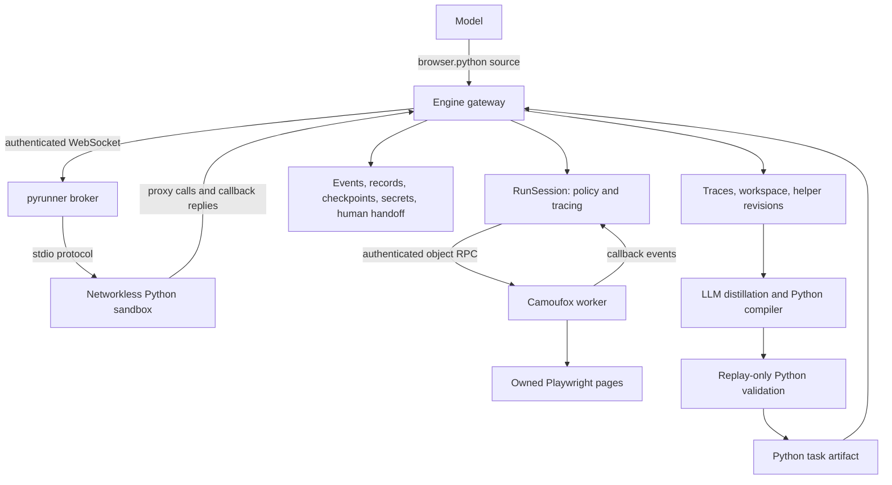

# AI browser harness

Browser runs expose **`browser.python({source, timeoutMs?})` and `browser.screenshot({selector?})`**. Python receives synchronous Playwright `page`, `context`, and `expect` objects, plus `workflow` for Tabductor services. AI exploration and compiled tasks use the same Python runtime. No additional anchor-action, `harness.*`, `api`/`td`, or JavaScript tool is exposed.

The registry is [buildBrowserCodeTools](../packages/agent/src/tools.ts), implemented in [python-tool.ts](../packages/agent/src/python-tool.ts). [python-guidance.ts](../packages/agent/src/python-guidance.ts) supplies the model instructions.

## Components and boundaries



| Component | Responsibility | Code |
| --- | --- | --- |
| Executor and AI loop | Acquire the lease, construct run services, execute cells and finish/suspend the task. | [executor.ts](../packages/agent/src/executor.ts), [loop.ts](../packages/agent/src/loop.ts) |
| Gateway | Validate calls, journal effects before dispatch, record evidence and enforce completion. | [python-tool.ts](../packages/agent/src/python-tool.ts) |
| Runner client | Protocol-v3 messages, reentrant callbacks, output, execution budgets and cancellation. | [python-runner.ts](../packages/agent/src/python-runner.ts) |
| pyrunner broker | Authenticate the engine, manage execution containers/pods, relay streams. It implements no browser tools. | [main.ts](../apps/python-runner/src/main.ts), [containers.ts](../apps/python-runner/src/containers.ts) |
| Sandbox supervisor | Fresh interpreter per cell, injected objects, helper loading and workspace persistence. | [tabductor_runner.py](../vendor/browser-harness/src/browser_harness/tabductor_runner.py) |
| Python proxy | Synchronous Playwright signatures, object references, callbacks, bytes and workflow namespace. | [playwright_proxy.py](../vendor/browser-harness/src/browser_harness/playwright_proxy.py) |
| Session and driver | Host policy, resource accounting and authenticated worker transport. | [session.ts](../packages/browser/src/session.ts), [camoufox-worker-driver.ts](../packages/browser/src/camoufox-worker-driver.ts) |
| Browser worker | Own real objects and Camoufox, fence ownership generations, execute operations and deliver callbacks. | [automation endpoint](../apps/browser-worker/src/main.py), [playwright_worker.py](../vendor/browser-harness/src/browser_harness/playwright_worker.py) |

Camoufox runs only in the worker. Python never receives a browser connection or profile credentials. The vendored harness supplies the proxy and worker implementation; its upstream CLI, daemon and CDP attachment path are not used here. **pyrunner executes Python; Camoufox executes the website.**

## Public API

```python
from playwright.sync_api import Page, Locator, expect, TimeoutError

# page, context and workflow are injected for the current run.

page.goto(workflow.input["url"])
page.get_by_role("textbox", name="Body").fill(workflow.input["body"])
page.get_by_role("button", name="Save").click()
expect(page.locator("article")).to_have_text(workflow.input["body"])
workflow.emit(type="record.saved", packet={"id": workflow.input["id"]},
              dedupeKey=workflow.input["id"])
workflow.done()
```

Imports are optional: `page`, `context`, `expect` and `workflow` are injected. Standard browser types and errors are importable from `playwright.sync_api`; `TimeoutError` catches browser timeouts, and `Error` catches browser failures. Existing `browser_harness` imports remain compatible with saved helpers. `browser.screenshot` returns a viewport image (or selector crop) without starting a Python cell. Calls return values or raise Python exceptions. `print()` contributes tool output; screenshots also become image attachments. Finishing a cell does not finish the task. Host-accepted terminal calls stop the cell through an internal exception, after which persistence runs.

Browser operations include locators, DOM evaluation, frames, element/JS handles, keyboard/mouse/touch input, assertions, screenshots, uploads/downloads, request/response objects, event expectations, routes and synchronous callbacks. `context.pages` contains owned pages; `context.new_page()` creates a normal owned page with no opener; its ownership survives later cells. DOM evaluation, handles and exposed callbacks use native Playwright evaluation. For application globals, use Camoufox's explicit JSON-only main-world form: `page.evaluate("mw:() => window.appData")`; main-world evaluation cannot return handles. `context.request` permits same-origin requests with redirects disabled.

The exact contract is the checked-in [manifest](../vendor/browser-harness/src/browser_harness/playwright_manifest.json), generated from pinned **Playwright 1.55.0** by [generate_playwright_manifest.py](../vendor/browser-harness/scripts/generate_playwright_manifest.py). Both endpoints reject unknown members. The contract covers every generated public class/member in that version (36 classes, 646 members), plus public typed dictionaries and aliases. Classes retain their property/method distinction, argument names/defaults, handle inheritance and per-cell object identity. Context operations, Clock, Worker, Video and Tracing are included. [Compatibility scope and tests](playwright-compatibility.md) distinguish API coverage from host and browser constraints.

| Workflow methods | Responsibility |
| --- | --- |
| `input` | Current trigger packet. |
| `emit`, `emit.batch` | Schema-validated, deduplicated events. |
| `record.verify`, `record.outcome` | Compare fresh browser readback on the host and account for the record. |
| `checkpoint.get/set`, `memory.get/set`, `status` | Durable progress, exploration memory and effect uncertainty. |
| `history.read`, `output.read` | Retrieve retained operation evidence and output. |
| `secrets.fill` | Fill a named secret into a live locator through the host broker. |
| `captcha.providers/create_task/get_result/wait/solve/push_variable` | Host-owned native CAPTCHA provider calls, durable jobs and internal credit accounting. See [Python CAPTCHA services](captcha-python-api.md). |
| `human_action.request` | Suspend for an observed blocker requiring human input. |
| `done`, `fail`, `deopt`, `yield_control` | Finish, fail, hand off to AI, or continue in a fresh cell. |
| `describe` | Discover supported browser members and available workflow schemas. |

For example, `workflow.describe(name="Locator.click")` describes a browser member; `workflow.describe(name="record.verify")` describes a workflow operation. Services such as secrets and record accounting require the corresponding run capability.

Use ordinary Python files and modules (`open`, `pathlib`, `json`, `csv`). Edit `agent_helpers.py` to persist reusable task helpers, pinned by revision per invocation. Public workspace, batch, file-handle and helper tool families do not duplicate Python's file API. `workflow.checkpoint_files()` explicitly commits files; cell termination also checkpoints them.

## Calls, callbacks and state

A locator call crosses the sandbox proxy and broker to the engine. The gateway records invocation/operation IDs and arguments, checks control, and journals effects before dispatch. The session forwards authenticated `/automation` RPC with session generation, input generation, command ID and invocation ID. The worker resolves the object in that invocation's registry and owned page scope, checks the manifest member and executes real Playwright. Results follow the reverse route.

The typed codec supports JSON values, scoped references, bytes, regexes, nonfinite numbers and callback references. Objects expire at cell end; reacquire them in later cells. Browser state survives because the worker owns it independently.

Long operations return tickets. Polling delivers callback events while the parent is pending. Python callbacks may make nested browser calls: a pending callback token allows reentrancy past the worker's ordinary operation lock. Callback starts, nested calls and completion are traced. Cleanup cancels jobs/expectations, unregisters listeners/routes, disposes handles and expires exposed bindings. Takeover closes scopes before draining commands.

| State | Lifetime |
| --- | --- |
| Python globals and remote references | One cell. |
| DOM, pages, login/profile state | Leased browser session. |
| Workspace | Blob-backed snapshots restored in replacement sandboxes. |
| Helper source | Task-scoped, versioned and pinned. |
| Checkpoints/effect journal | Durable run state; checkpoints are not atomic with website writes. |
| History, output and memory | Durable, subject to storage and redaction settings. |

[browser-continuity.ts](../packages/agent/src/browser-continuity.ts) shares workspace and exploration context across runs of any browser task within one execution. Record accounting and effect progress remain per run. [workspace.ts](../packages/agent/src/workspace.ts) and [context-history.ts](../packages/agent/src/context-history.ts) implement persistence.

The execution container has no network, browser credentials, Docker socket or Kubernetes token; the broker alone launches it. Default bounds include 24,000 source characters, 1,000 host calls per cell, 180 seconds of active Python time, 120-second browser operations, 8 MB transfers/files and a 32 MB/256-file workspace. Host waits pause the Python timer; cancellation and run limits still apply. See [runner](../packages/agent/src/python-runner.ts), [container configuration](../apps/python-runner/src/containers.ts), and [workspace](../packages/agent/src/workspace.ts).

## Compilation and recovery

Compilation is **per reusable task**. [sdk-evidence.ts](../packages/compiler/src/sdk-evidence.ts) reads all source-run cells, operations/results, callbacks, helper revisions and starting workspace. [sdk-compile.ts](../packages/compiler/src/sdk-compile.ts) also considers compatible prior runs with the same task/content/destination scope and runtime. Each supporting run receives its own grounded plan, allowing exploration sequences to differ.

The LLM first identifies required work and explains discarded exploration, then writes a Python module defining `run(page, context, workflow)`. [python-validation.ts](../packages/agent/src/python-validation.ts) runs it in the same sandbox against a replay-only host: no live browser or external effects. Validation changes input/observed values and object IDs, checks retained operations/effect order, requires verification and event dedupe keys, and injects operation failures and changed guard observations. Failed checks refuse promotion. The runner also applies a conservative Python AST lint to compiled source.

[compiled-executor.ts](../packages/agent/src/compiled-executor.ts) runs accepted Python through the same gateway without model calls. Failed guards, operations, uncertain effects or missing verification deopt into AI on the same run, browser and durable state. The stopped artifact does not restart its writes. Artifacts pin the API/runtime/browser versions and helper source.

Runtime `tabductor-python-playwright-v1`, API `playwright-python-v1` and operation evidence version `3` identify this architecture. [Migration 0050](../packages/db/migrations/0050_python_playwright_runtime.sql) retires old artifacts/jobs and returns affected browser tasks to AI. Legacy JS/CDP and `harness.*` code can remain for historical tests/internal consumers, but the live browser registry does not expose it.

## Deployment and checks

Python and Camoufox are required. The engine needs `PYTHON_RUNNER_URL` and `PYTHON_RUNNER_TOKEN`; incompatible backend/browser-mode values fail startup. Local, staging and AWS scripts provision the runner; Helm enables it by default. See [engine configuration](../apps/engine/src/main.ts), [local startup](../scripts/local/up.mjs), [runner chart](../infra/helm/tabductor/templates/python-runner.yaml), and [deployment notes](python-browser-harness.md).

Coverage includes [proxy/protocol/replay tests](../packages/agent/src/playwright-python.test.ts), [real worker contract tests](../apps/browser-worker/tests/test_playwright_proxy.py), [container isolation](../tests/system/python-runner-container.test.ts), [writer compilation/deopt](../tests/system/python-harness.test.ts), [file-backed datasets/partial writes](../tests/system/python-dataset.test.ts), and [login recovery](../tests/system/python-login-recovery.test.ts). `pnpm test:python-harness` builds disposable Docker services and runs the system acceptance tests.

Graph authoring uses ordinary browser tasks and event dependencies. A task can work across websites and complete the whole request. There are no setup/source/writer roles, destination mapping publication prerequisites, or host-generated readiness envelopes. `limits.harness` only links a task to user requirements. Record tracking and normalization are optional. Explicit user constraints, event schemas, execution leases and browser ownership still apply. Legacy role metadata is discarded on graph parsing and ignored at execution; old authored topology and prompt prose require regeneration to change.
